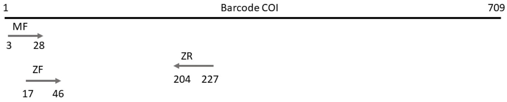
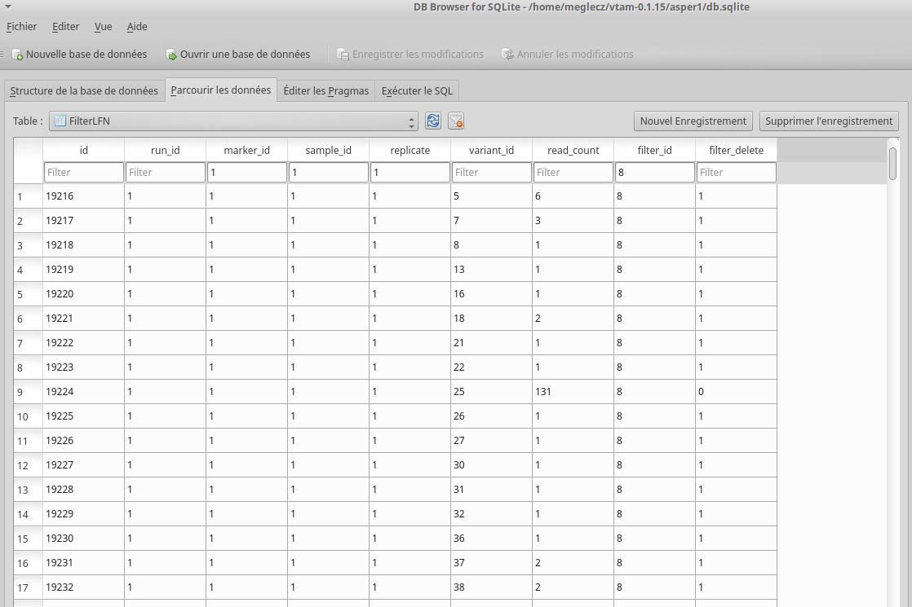

Tutorial
============

.. note::
    **Important!** Before running any command, do not forget to change directory to vtam and activate the conda environment.

    .. code-block:: bash

        cd vtam
        conda activate vtam

.. note::
    With the exception of BLAST database files and the sqlite database all I/O files of VTAM are text files, that can be opened and edited by a simple text editor (gedit, geany, Notepad++ etc.):

    - TSV:  Text files with tab separated values. Can also be opened by spreadsheets such as LibreOffice, Excel
    - YML: Text files used to provide parameter names and values

.. _data_tutorial:

Data
---------------------------------------------------------------------------------

In this tutorial, we use a small test dataset based from our previous publication: `PMID 28776936 <https://pubmed.ncbi.nlm.nih.gov/28776936>`_. 
In this dataset, each :ref:`sample <sample_glossary>` was amplified by two overlapping :ref:`markers <marker_glossary>` (mfzr and zfzr), 
targeting the first 175-181 nucleotides of the COI gene (:ref:`Fig. 2 <fig2_tutorial>`). 
We had three PCR :ref:`replicates <replicate_glossary>` for each sample-marker combination (:ref:`Fig. 1 <fig1_overview>`). 
The samples are :ref:`tagged <tag_glossary>`, so the combination of the forward and reverse tags can be used to identify the origin (sample) of each read. 

To reduce run time, the test dataset contains only one :ref:`mock sample <mock_glossary>`, one negative control and two real samples.

.. _fig2_tutorial:

   Figure 2. Positions on the primer on the COI gene used in the test dataset.

You can download these FASTQ files from here with this command:

.. code-block:: bash

    wget -nc https://github.com/aitgon/vtam/releases/latest/download/fastq.tar.gz -O fastq.tar.gz
    tar zxvf fastq.tar.gz
    rm fastq.tar.gz

This will create a "FASTQ" directory with 12 FASTQ files:

.. code-block:: bash

    $ ls fastq/
    mfzr_1_fw.fastq
    mfzr_1_rv.fastq
    ...

mfzr_1_fw.fastq: Forward reads of replicates of the MFZR marker (all samples)

.. _merge_tutorial:

merge: Merge FASTQ files
----------------------------

The simplest use of vtam is to analyze one sequencing run (run1) and one marker (MFZR).

The first step is to :ref:`merge <merge_glossary>` the FASTQ files and transform them into fasta files. It can be skipped, if you have single end reads, or your paired sequences have already been merged and transformed into fasta files.

Create a TSV (tab-separated file), with a header and 10 columns with all the information per FASTQ file pair. 
We will call it *fastqinfo_mfzr.tsv* in this tutorial and you can download it here: :download:`fastqinfo_mfzr.tsv <../../vtam/data/example/fastqinfo_mfzr.tsv>`. This TSV file will determine, which file pairs should be merged. These files should be all in the *fastq* directory. This directory can contain other files as well, but they will not be analyzed.

The following columns are required in the *fastqinfo_mfzr.tsv*:

- TagFwd
- PrimerFwd
- TagRev
- PrimerRev
- Marker
- Sample
- Replicate
- Run
- FastqFwd
- FastqRev

Tag and primer sequences are in 5' => 3' orientation.

Hereafter are the first lines of the *fastqinfo_mfzr.tsv* file:

.. code-block:: bash

    TagFwd    PrimerFwd    TagRev    PrimerRev    Marker    Sample    Replicate    Run    FastqFwd    FastqRev
    tcgatcacgatgt    TCCACTAATCACAARGATATTGGTAC    tgtcgatctacagc    WACTAATCAATTWCCAAATCCTCC    mfzr    tpos1_run1    1    run1    mfzr_1_fw.fastq    mfzr_1_rv.fastq
    agatcgtactagct    TCCACTAATCACAARGATATTGGTAC    tgtcgatctacagc    WACTAATCAATTWCCAAATCCTCC    mfzr    tnegtag_run1    1    run1    mfzr_1_fw.fastq    mfzr_1_rv.fastq

We propose to work in a project directory called *asper1* (the dataset comes from a project on *Zingel asper*) and copy user created input files such as *fastqinfo_mfzr.tsv* to the *asper1/user_input* directory.

.. code-block:: bash

    asper1
    `-- user_input
      `-- fastqinfo_mfzr.tsv
    fastq
    |-- mfzr_1_fw.fastq
    |-- mfzr_1_rv.fastq
    |-- ...

Run **merge** for all file-pairs in the *fastqinfo_mfzr.tsv*

.. code-block:: bash

    vtam merge --fastqinfo asper1/user_input/fastqinfo_mfzr.tsv --fastqdir fastq --fastainfo asper1/run1_mfzr/fastainfo.tsv --fastadir asper1/run1_mfzr/merged -v --log asper1/vtam.log

.. note::
    For info on I/O files see the :ref:`Reference section <merge_reference>`

This command adds a *merged* directory and a new *fastainfo_mfzr.tsv* file:

.. code-block:: bash

    asper1
    |-- run1_mfzr
    |  |-- fastainfo.tsv
    |  `-- merged
    |    |-- mfzr_1_fw.fasta
    |    |-- mfzr_2_fw.fasta
    |    `-- mfzr_3_fw.fasta
    |-- user_input
    |  |-- fastqinfo_mfzr.tsv
    |-- vtam.err
    `-- vtam.log
    fastq
    |-- mfzr_1_fw.fastq
    |-- mfzr_1_rv.fastq
    |-- ...

The first lines of the *fastainfo_mfzr.tsv* look like this:

.. code-block:: bash

    run    marker    sample    replicate    tagfwd    primerfwd    tagrev    primerrev    mergedfasta
    run1    mfzr    tpos1_run1    1    tcgatcacgatgt    TCCACTAATCACAARGATATTGGTAC    tgtcgatctacagc    WACTAATCAATTWCCAAATCCTCC    mfzr_1_fw.fasta
    run1    mfzr    tnegtag_run1    1    agatcgtactagct    TCCACTAATCACAARGATATTGGTAC    tgtcgatctacagc    WACTAATCAATTWCCAAATCCTCC    mfzr_1_fw.fasta

.. _random_seq_tutorial:

random_seq: Create a smaller randomized dataset from the main dataset (Optional)
--------------------------------------------------------

The random_seq command is designed to create a smaller dataset with a given number of randomly selected sequences in each of its output files. This can be used to have the same number of reads for each replicates, and to reduce the number of reads.
The input fasta files are listed in the fastainfo.tsv file.

.. code-block:: bash

    vtam random_seq --fastainfo asper1/run1_mfzr/fastainfo.tsv --fastadir asper1/run1_mfzr/merged --random_seqdir asper1/run1_mfzr/randomized --random_seqinfo asper1/run1_mfzr/random_seq_info.tsv --samplesize 30000 -v

.. note::
        For info on I/O files see the :ref:`Reference section <random_seq_reference>`

The FASTA files with the randomized reads are written to the *asper1/run1_mfzr/randomized* directory:

.. code-block:: bash

    asper1
    |-- run1_mfzr
    |  |-- fastainfo.tsv
    |  |-- random_seq_info.tsv
    |  |--...
    |  `-- randomized
    |    |-- mfzr_1_fw_sampled.fasta
    |    |-- mfzr_2_fw_sampled.fasta
    |    |-- mfzr_3_fw_sampled.fasta
    |    `-- 
    |-- ...
    ...

In addition, the TSV file *asper1/run1_mfzr/random_seq_info.tsv* is created which is the updated version of the fastainfo.tsv file. The *random_seq_info.tsv* file looks like this:

.. code-block:: bash

    run    marker    sample    replicate    tagfwd    primerfwd    tagrev    primerrev    mergedfasta
    run1    mfzr    tpos1_run1    1    tcgatcacgatgt    TCCACTAATCACAARGATATTGGTAC    tgtcgatctacagc    WACTAATCAATTWCCAAATCCTCC    mfzr_1_fw_sampled.fasta
    run1    mfzr    tnegtag_run1    1    agatcgtactagct    TCCACTAATCACAARGATATTGGTAC    tgtcgatctacagc    WACTAATCAATTWCCAAATCCTCC    mfzr_1_fw_sampled.fasta
	
	
.. _sortreads_tutorial:

sortreads: Demultiplex and trim the reads
--------------------------------------------------------

There is a single command **sortreads** to :ref:`demultiplex <demultiplexing_glossary>` the reads according to :ref:`tags <tag_glossary>` 
and to :ref:`trim <trimming_glossary>` off tags and primers.

The sortreads command is designed to deal with a dual indexing, where forward and reverse tag combinations are used to determine the origin of the reads. This is one of the most complex case of demultiplexing, therefore we implemented **sortreads** to help users.

For simpler cases, we suggest using `cutadapt <https://cutadapt.readthedocs.io/en/stable/>`_ directly, since it is quite straightforward.

In this example, we run the sortreads command on the output files of the random_seq, but if you have skipped the random_seq, it is possible to run it directly on the output of merge.  

.. code-block:: bash

    vtam sortreads --fastainfo asper1/run1_mfzr/random_seq_info.tsv --fastadir asper1/run1_mfzr/randomized --sorteddir asper1/run1_mfzr/sorted -v --log asper1/vtam.log

.. note::
        For info on I/O files see the :ref:`Reference section <sortreads_reference>`

The FASTA files with the sorted reads are written to the *asper1/sorted* directory:

.. code-block:: bash

    asper1
    |-- run1_mfzr
    |  |-- fastainfo.tsv
    |  |-- ...
    |  `-- sorted
    |    |-- run1_MFZR_14ben01_1_mfzr_1_fw_sampled_trimmed.fasta
    │    |-- run1_MFZR_14ben01_2_mfzr_2_fw_sampled_trimmed.fasta
    |    |-- ...
    |    `-- sortedinfo.tsv
    |-- ...
    ...

In addition, the TSV file *asper1/run1_mfzr/sorted/sortedinfo.tsv* lists the information, *i.e.* run, marker, sample and replicate about each sorted FASTA file. 
The *sortedinfo.tsv* file looks like this:

.. code-block:: bash

    run    marker    sample    replicate    sortedfasta
    run1    MFZR    tpos1_run1    1    run1_MFZR_14ben01_1_mfzr_1_fw_sampled_trimmed.fasta
    run1    MFZR    tnegtag_run1    1    run1_MFZR_14ben01_2_mfzr_2_fw_sampled_trimmed.fasta

.. _filter_tutorial:

filter: Filter variants and create the ASV table
---------------------------------------------------

The **filter** command is typically first run with default parameters. From the output, users should identify clearly 
unwanted (‘:ref:`delete <delete_glossary>`’) and clearly necessary (‘:ref:`keep <keep_glossary>`’) 
occurrences (see :ref:`Reference section <optimize_reference>` for details). 
These false positive and false negative occurrences will be used as input to the **optimize** command. 
The **optimize** command will then suggest an optimal parameter combination tailored to your dataset. 
Then **filter** command should be run again with the optimized parameters.

Let's run first the **filter** command with default parameters.

.. code-block:: bash

    vtam filter --db asper1/db.sqlite --sortedinfo asper1/run1_mfzr/sorted/sortedinfo.tsv --sorteddir asper1/run1_mfzr/sorted --asvtable asper1/run1_mfzr/asvtable_default.tsv -v --log asper1/vtam.log

.. note::
    For info on I/O files see the :ref:`Reference section <filter_reference>`

This command creates two new files *db.sqlite* and *asvtable_mfzr_default.tsv*:

.. code-block:: bash

    asper1
    |-- db.sqlite
    |-- run1_mfzr
    |  |-- asvtable_default.tsv
    |-- ...
    ...

The database *asper1/db.sqlite* contains one table by filter, and in each table occurrences are marked as deleted 
(filter_delete = 1) or retained  (filter_delete = 0). This database can be opened with a sqlite browser program 
(For example, https://sqlitebrowser.org / or https://sqlitestudio.pl).

The *asper1/run1_mfzr/asvtable_default.tsv* contains information about the variants that passed all the filters such as 
the run, maker, read count over all replicates of a sample and the sequence. 
Hereafter are the first lines of the *asvtable_default.tsv*

.. code-block:: bash

    run    marker    variant    sequence_length    read_count    tpos1_run1    tnegtag_run1    14ben01    14ben02    clusterid    clustersize    chimera_borderline    sequence
    run1    MFZR    25    181    478    478    0    0    0    25    1    False    ACTATACCTTATCTTCGCAGTATTCTCAGGAATGCTAGGAACTGCTTTTAGTGTTCTTATTCGAATGGAACTAACATCTCCAGGTGTACAATACCTACAGGGAAACCACCAACTTTACAATGTAATCATTACAGCTCACGCATTCCTAATGATCTTTTTCATGGTTATGCCAGGACTTGTT
    run1    MFZR    51    181    165    0    0    0    165    51    1    False    ACTATATTTAATTTTTGCTGCAATTTCTGGTGTAGCAGGAACTACGCTTTCATTGTTTATTAGAGCTACATTAGCGACACCAAATTCTGGTGTTTTAGATTATAATTACCATTTGTATAATGTTATAGTTACGGGTCATGCTTTTTTGATGATCTTTTTTTTAGTAATGCCTGCTTTATTG

.. note::
    Filter can be run with the **known_occurrences** argument that will add an additional column for each mock sample flagging expected variants. 
    This helps in creating the **known_occurrences.tsv** input file for the optimization step. For details see the :ref:`Reference section <MakeAsvTable_reference>`

.. _taxassign_tutorial:

taxassign: Assign variants of ASV table to taxa
--------------------------------------------------

The **taxassign** command assigns ASV sequences in the last column of a TSV file such as the *asvtable_default.tsv* file to taxa.

The **taxassign** command needs a :ref:`BLAST database <BLAST_database_reference>` (containing reference sequences of known taxonomic origin) and the :ref:`taxonomy information file <taxonomy_reference>`.

You can download the latest version of the `COInr database <https://doi.org/10.5281/zenodo.6555984>`_ formatted to VTAM from OSF (https://osf.io/vrfwz/). This database contains sequneces from `Genbank <https://www.ncbi.nlm.nih.gov/nucleotide/>`_ and `BOLD <https://www.boldsystems.org/>`_.
If you want to customize it, you can use `mkCOInr <https://github.com/meglecz/mkCOInr>`_.

Download and unpack the database and the associated taxonomy file:

.. note::
    You might need to update the URL and the file names for the latest version available in `OSF <https://osf.io/vrfwz/>`_ 

.. code-block:: bash

    mkdir vtam_db
    cd vtam_db
    wget https://osf.io/9qyzf/download -O COInr_vtam_taxonomy_2022_05_06.tsv.gz
    gunzip COInr_vtam_taxonomy_2022_05_06.tsv.gz

    wget https://osf.io/qyr3b/download -O COInr_blast_2022_05_06.tar.gz
    tar -zxvf COInr_blast_2022_05_06.tar.gz
    rm COInr_blast_2022_05_06.tar.gz
    

These commands result in these new files:

.. code-block:: bash

    vtam_db
    ├── COInr_blast_2022_05_06
    │   ├── COInr_blast_2022_05_06.nhr
    │   ├── COInr_blast_2022_05_06.nin
    │   ├── COInr_blast_2022_05_06.nog
    │   ├── COInr_blast_2022_05_06.nsd
    │   ├── COInr_blast_2022_05_06.nsi
    │   └── COInr_blast_2022_05_06.nsq
    └── COInr_vtam_taxonomy_2022_05_06.tsv

.. note::
    Alternatively, you can use your own custom database or the NCBI nucleotide database :ref:`Reference section <BLAST_database_reference>`

Then, we can carry out the taxonomic assignation of variants in the *asvtable_default.tsv* with the following command:

.. code-block:: bash

    vtam taxassign --db asper1/db.sqlite --asvtable asper1/run1_mfzr/asvtable_default.tsv --output asper1/run1_mfzr/asvtable_default_taxa.tsv --taxonomy vtam_db/COInr_vtam_taxonomy_2022_05_06.tsv --blastdbdir vtam_db/COInr_blast_2022_05_06 --blastdbname COInr_blast_2022_05_06 -v --log asper1/vtam.log

.. note::
    For info on I/O files see the :ref:`Reference section <taxassign_reference>`

This results in an additional file:

.. code-block:: bash

    asper1/
    |-- run1_mfzr
    |  |-- asvtable_default.tsv
    |  |-- asvtable_default_taxa.tsv

.. _make_known_occurrences_tutorial:

make_known_occurrences: Create file containing the known_occurences.tsv to be used as an inut for optimize
--------------------------------------------------------

The make_known_occurrences command is designed to automatically create files containing the known and the missing occurences and it can be run if the expected occurrences in the mock samples are known in advance. Otherwise, it should be created by hand, based on the *asvtable_default_taxa.tsv* file.

The make_known_occurrences command requires the :ref:`sample_types_io` and :ref:`mock_composition_io` files as in input. 

The exemple files can be downloaded from here: :download:`sample_types.tsv <../../vtam/data/example/sample_types.tsv>`, :download:`mock_composition_mfzr.tsv <../../vtam/data/example/mock_composition_mfzr.tsv>`

.. code-block:: bash

    vtam make_known_occurrences --asvtable asper1/run1_mfzr/asvtable_default_taxa.tsv --sample_types asper1/user_input/sample_types.tsv --mock_composition asper1/user_input/mock_composition_mfzr.tsv --known_occurrences asper1/run1_mfzr/known_occurrences_mfzr.tsv --missing_occurrences asper1/run1_mfzr/missing_occurrences_mfzr.tsv -v

.. note::
        For info on I/O files see the :ref:`Reference section <make_known_occurrences_reference>`

The output is the *known_occurrences_mfzr.tsv* file wich can be used in the optimize step. If there are missing expected variants, they are written to the *missing_occurrences_mfzr.tsv* file.

.. _optimize_tutorial:

optimize: Compute optimal filter parameters based on mock and negative samples
---------------------------------------------------------------------------------------

The **optimize** command helps users choose optimal parameters for filtering that are specifically adjusted to the dataset. 
This optimization is based on mock samples and negative controls.

Users should prepare a TSV file (*known_occurrences_mfzr.tsv*) with occurrences to be kept in the results
(typically expected variants of the mock samples) and occurrences to be clearly deleted 
(typically all occurrences in negative controls, and unexpected occurrences in the mock samples). 
For details see the :ref:`Reference section <optimize_reference>`.

The example TSV file for the known occurrences of the MFZR marker can be found here : :download:`known_occurrences_mfzr.tsv <../../vtam/data/example/known_occurrences_mfzr.tsv>`.

The first lines of this file look like this:

.. code-block:: bash

    marker	run	sample	mock	variant	action	sequence
    MFZR    run1    tpos1_run1    1        keep    ACTATATTTTATTTTTGGGGCTTGATCCGGAATGCTGGGCACCTCTCTAAGCCTTCTAATTCGTGCCGAGCTGGGGCACCCGGGTTCTTTAATTGGCGACGATCAAATTTACAATGTAATCGTCACAGCCCATGCTTTTATTATGATTTTTTTCATGGTTATGCCTATTATAATC
    MFZR    run1    tpos1_run1    1        keep    ACTTTATTTTATTTTTGGTGCTTGATCAGGAATAGTAGGAACTTCTTTAAGAATTCTAATTCGAGCTGAATTAGGTCATGCCGGTTCATTAATTGGAGATGATCAAATTTATAATGTAATTGTAACTGCTCATGCTTTTGTAATAATTTTCTTTATAGTTATACCTATTTTAATT

    ...
    MFZR    run1    tpos1_run1    1        delete    TTTATATTTCATTTTTGGTGCATGATCAGGTATGGTGGGTACTTCCCTTAGTTTATTAATTCGAGCAGAACTTGGTAATCCTGGTTCTTTGATTGGCGATGATCAGATTTATAACGTTATTGTCACTGCCCATGCTTTTATTATGATTTTTTTTATAGTGATACCTATTATAATT
    MFZR    run1    tnegtag_run1    0        delete    TTTATATTTTATTTTTGGAGCCTGAGCTGGAATAGTAGGTACTTCCCTTAGTATACTTATTCGAGCCGAATTAGGACACCCAGGCTCTCTAATTGGAGACGACCAAATTTATAATGTAATTGTTACTGCTCATGCTTTTGTAATAATTTTTTTTATAGTTATGCCAATTATAATT

.. note::

    It is possible to add extra columns with your notes (for example taxon names) to this file after the *sequence* column. 
    They will be ignored by VTAM.

The **optimize** command is run like this:

.. code-block:: bash

    vtam optimize --db asper1/db.sqlite --sortedinfo asper1/run1_mfzr/sorted/sortedinfo.tsv --sorteddir asper1/run1_mfzr/sorted --known_occurrences asper1/run1_mfzr/known_occurrences_mfzr.tsv --outdir asper1/run1_mfzr -v --log asper1/vtam.log

.. note::

    For info on I/O files see the :ref:`Reference section <optimize_reference>`

This command creates four new files:

.. code-block:: bash

    asper1/
    |-- db.sqlite
    |-- run1_mfzr
    |  |-- ...
    |  |-- optimize_lfn_sample_replicate.tsv
    |  |-- optimize_lfn_read_count_and_lfn_variant.tsv
    |  |-- optimize_lfn_variant_specific.tsv
    |  |-- optimize_pcr_error.tsv

.. note::

    Running vtam optimize will run three underlying scripts:

    - **OptimizePCRerror**, to optimize **pcr_error_var_prop**
    - **OptimizeLFNsampleReplicate**, to optimize **lfn_sample_replicate_cutoff**
    - **OptimizeLFNreadCountAndLFNvariant**, to optimize **lfn_read_count_cutoff** and **lfn_variant_cutoff**.

    While **OptimizePCRerror** and **OptimizeLFNsampleReplicate** do not depend on the other two parameters to be optimized, **OptimizeLFNreadCountAndLFNvariant** does. For a finer tuning, it is possible to run the three subscripts one by one, and use the optimized values of **pcr_error_var_prop** and **lfn_sample_replicate_cutoff** instead of their default values, when running **OptimizeLFNreadCountAndLFNvariant**. This procedure can propose less stringent values for **lfn_read_count_cutoff** and **lfn_variant_cutoff**, but still eliminate as many as possible unexpected occurrences, and keep all expected ones.

    To run just one subscript, the --**until** flag can be added to the **vtam optimize** command

    - until OptimizePCRerror
    - unlit OptimizeLFNsampleReplicate
    - until OptimizeLFNreadCountAndLFNvariant

    *e.g.*

    .. code-block:: bash

        vtam optimize --db asper1/db.sqlite --sortedinfo asper1/run1_mfzr/sorted/sortedinfo.tsv --sorteddir asper1/run1_mfzr/sorted --known_occurrences asper1/run1_mfzr/known_occurrences_mfzr.tsv --outdir asper1/run1_mfzr -v --log asper1/vtam.log --until OptimizePCRerror

        vtam optimize --db asper1/db.sqlite --sortedinfo asper1/run1_mfzr/sorted/sortedinfo.tsv --sorteddir asper1/run1_mfzr/sorted --known_occurrences asper1/run1_mfzr/known_occurrences_mfzr.tsv --outdir asper1/run1_mfzr -v --log asper1/vtam.log --until OptimizeLFNsampleReplicate

    Based on the output, create a *params_optimize_mfzr.yml* file that will contain the optimal values suggested for **lfn_sample_replicate_cutoff** and **pcr_error_var_prop**
    
    .. code-block:: bash
    
        lfn_sample_replicate_cutoff: 0.003
        pcr_error_var_prop: 0.1

    Run **OptimizeLFNreadCountAndLFNvariant** with the optimized parameters for the above two parameters.

    .. code-block:: bash

        vtam optimize --db asper1/db.sqlite --sortedinfo asper1/run1_mfzr/sorted/sortedinfo.tsv --sorteddir asper1/run1_mfzr/sorted --known_occurrences asper1/run1_mfzr/known_occurrences_mfzr.tsv --outdir asper1/run1_mfzr -v --log asper1/vtam.log --until OptimizeLFNreadCountAndLFNvariant --params asper1/user_input/params_optimize_mfzr.yml

    This step will suggest the following parameter values

    .. code-block:: bash
    
        lfn_variant_cutoff: 0.001
        lfn_read_count_cutoff: 20
        
    For simplicity, we continue the tutorial with parameters optimized previously, with running all 3 optimize steps in one command.

.. _filter_optimized_tutorial:

filter: Create an ASV table with optimal parameters and assign variants to taxa
---------------------------------------------------------------------------------

See the :ref:`Reference section <optimize_reference>` on how to establish the optimal parameters from the outout of **optimize**.
Once the optimal filtering parameters are chosen, rerun the **filter** command using the existing *db.sqlite* database 
that already has all the variant counts.

Make a *params_mfzr.yml* file that contains the parameter names and values that differ from the default settings. 

The *params_mfzr.yml* can be found here: :download:`params_mfzr.yml <../../vtam/data/example/params_mfzr.yml>` and it looks like this:

.. code-block:: bash

    lfn_variant_cutoff: 0.001
    lfn_sample_replicate_cutoff: 0.003
    lfn_read_count_cutoff: 70
    pcr_error_var_prop: 0.1

Run filter with optimized parameters:

.. code-block:: bash

    vtam filter --db asper1/db.sqlite --sortedinfo asper1/run1_mfzr/sorted/sortedinfo.tsv --sorteddir asper1/run1_mfzr/sorted --params asper1/user_input/params_mfzr.yml --asvtable asper1/run1_mfzr/asvtable_optimized.tsv -v --log asper1/vtam.log

Running again **taxassign** will complete the *asvtable_optimized.tsv* with the taxonomic information. It will be very quick since most variants in the table have already gone through the taxonomic assignment, and these assignations are extracted from the *db.sqlite*.

.. code-block:: bash

    vtam taxassign --db asper1/db.sqlite --asvtable asper1/run1_mfzr/asvtable_optimized.tsv --output asper1/run1_mfzr/asvtable_optimized_taxa.tsv --taxonomy vtam_db/COInr_vtam_taxonomy_2022_05_06.tsv --blastdbdir vtam_db/COInr_blast_2022_05_06 --blastdbname COInr_blast_2022_05_06 -v --log asper1/vtam.log

We finished our first analysis with VTAM! The resulting directory structure looks like this:

.. code-block:: bash

    asper1/
    |-- db.sqlite
    |-- run1_mfzr
    |  |-- asvtable_default.tsv
    |  |-- asvtable_default_taxa.tsv
    |  |-- asvtable_optimized.tsv
    |  |-- asvtable_optimized_taxa.tsv
    |  |-- fastainfo.tsv
    |  |-- merged
    |  |  |-- mfzr_1_fw.fasta
    |  |  |-- ...
    |  |-- optimize_lfn_sample_replicate.tsv
    |  |-- optimize_lfn_read_count_and_lfn_variant.tsv
    |  |-- optimize_lfn_variant_specific.tsv
    |  |-- optimize_pcr_error.tsv
    |  `-- sorted
    |    |-- run1_MFZR_14ben01_2_mfzr_2_fw_trimmed.fasta
    |    |-- ...
    |    `-- sortedinfo.tsv

.. _add_new_run-marker_tutorial:

Add new run-marker data to the existing database
-----------------------------------------------------

The same samples can be amplified by different but strongly overlapping markers. In this case, it makes sense to pool all the data into the same database, and produce just one ASV table, with information of both markers. This is the case in our test dataset.

It is also frequent to have different sequencing runs (with one or several markers) that are part of the same study. 
Feeding them to the same database ensures coherence in variant IDs, and gives the possibility to easily produce one 
ASV table with all the runs and avoids re-running the **taxassign** on variants that have already been assigned to a taxon.

**We assume that you have gone through the basic pipeline in the** :ref:`previous section <data_tutorial>`.

Let's see an example on how to complete the previous analyses with the dataset obtained for the same samples but for 
another marker (ZFZR). The principle is the same if you want to complete the analyses with data from a different 
sequencing run.
First, we need to prepare these user inputs:
The directory with the FASTQ files: :download:`fastqinfo_zfzr.tsv <../../vtam/data/example/fastqinfo_zfzr.tsv>`.

This is the **merge** command for the new run-marker:

.. code-block:: bash

    vtam merge --fastqinfo asper1/user_input/fastqinfo_zfzr.tsv --fastqdir fastq --fastainfo asper1/run1_zfzr/fastainfo.tsv --fastadir asper1/run1_zfzr/merged -v --log asper1/vtam.log

This is the **sortreads** command for the new marker ZFZR:

.. code-block:: bash

    vtam sortreads --fastainfo asper1/run1_zfzr/fastainfo.tsv --fastadir asper1/run1_zfzr/merged --sorteddir asper1/run1_zfzr/sorted -v --log asper1/vtam.log

The **filter** command for the new marker ZFZR is the same as in the basic pipeline, but we will complete the previous database *asper1/db.sqlite* with the new variants.

.. code-block:: bash

    vtam filter --db asper1/db.sqlite --sortedinfo asper1/run1_zfzr/sorted/sortedinfo.tsv --sorteddir asper1/run1_zfzr/sorted --asvtable asper1/run1_zfzr/asvtable_default.tsv -v --log asper1/vtam.log

Next we run the **taxassign** command for the new ASV table *asper1/asvtable_zfzr_default.tsv*:

.. code-block:: bash

    vtam taxassign --db asper1/db.sqlite --asvtable asper1/asvtable_zfzr_default.tsv --output asper1/asvtable_zfzr_default_taxa.tsv --taxonomy vtam_db/COInr_vtam_taxonomy_2022_05_06.tsv --blastdbdir vtam_db/COInr_blast_2022_05_06 --blastdbname COInr_blast_2022_05_06 -v --log asper1/vtam.log

Here, we prepare a new file of known occurrences for the ZFZR marker: :download:`known_occurences_zfzr.tsv <../../vtam/data/example/known_occurences_zfzr.tsv>`.
Then we run the **optimize** command with the known occurrences:

.. code-block:: bash

    vtam optimize --db asper1/db.sqlite --sortedinfo asper1/run1_zfzr/sorted/sortedinfo.tsv --sorteddir asper1/run1_zfzr/sorted --known_occurrences asper1/user_input/known_occurrences_zfzr.tsv --outdir asper1/run1_zfzr -v --log asper1/vtam.log

At this point, we prepare a new params file for the ZFZR marker: :download:`params_zfzr.yml <../../vtam/data/example/params_zfzr.yml>`.

Then we run the **filter** command with the optimized parameters:

.. code-block:: bash

    vtam filter --db asper1/db.sqlite --sortedinfo asper1/run1_zfzr/sorted/sortedinfo.tsv --sorteddir asper1/run1_zfzr/sorted --params asper1/user_input/params_zfzr.yml --asvtable asper1/run1_zfzr/asvtable_optimized.tsv -v --log asper1/vtam.log

Then we run the **taxassign** command of the optimized ASV table:

.. code-block:: bash

    vtam taxassign --db asper1/db.sqlite --asvtable asper1/run1_zfzr/asvtable_optimized.tsv --output asper1/run1_zfzr/asvtable_optimized_taxa.tsv --taxonomy vtam_db/COInr_vtam_taxonomy_2022_05_06.tsv --blastdbdir vtam_db/COInr_blast_2022_05_06 --blastdbname COInr_blast_2022_05_06 -v --log asper1/vtam.log

At this point, we have run the equivalent of the previous section (MFZR marker) for the ZFZR marker.
Now we can pool the two markers MFZR and ZFZR. This input TSV file *asper1/user_input/pool_run_marker.tsv* defines the run and marker combinations that must be pooled. The :download:`pool_run_marker.tsv <../../vtam/data/example/pool_run_marker.tsv>` that looks like this:

.. code-block:: bash

    run    marker
    run1    MFZR
    run1    ZFZR

Then the **pool** command can be used:

.. code-block:: bash

    vtam pool --db asper1/db.sqlite --runmarker asper1/user_input/pool_run_marker.tsv --asvtable asper1/asvtable_pooled_mfzr_zfzr.tsv --log asper1/vtam.log -v

.. note::
    For info on I/O files see the :ref:`Reference section <pool_reference>`.

The output *asvtable_pooled_mfzr_zfzr.tsv* is an asv table that contains all samples of all runs 
(in this example there is only one run), and all "unique" variants: variants identical in their overlapping regions 
are pooled into the one line.

Summing read count from different markers does not make sense.
In *asvtable_pooled_mfzr_zfzr.tsv* cells contain 1/0 for presence/absence instead of read counts.

Hereafter are the first lines of the *asvtable_pooled_mfzr_zfzr.tsv*.

.. code-block:: bash

    variant_id    pooled_variants    run    marker    tpos1_run1    tnegtag_run1    14ben01    14ben02    clusterid    clustersize    pooled_sequences    sequence
    25    25    run1    MFZR    1    0    0    0    25    1    ACTATACCTTATCTTCGCAGTATTCTCAGGAATGCTAGGAACTGCTTTTAGTGTTCTTATTCGAATGGAACTAACATCTCCAGGTGTACAATACCTACAGGGAAACCACCAACTTTACAATGTAATCATTACAGCTCACGCATTCCTAATGATCTTTTTCATGGTTATGCCAGGACTTGTT    ACTATACCTTATCTTCGCAGTATTCTCAGGAATGCTAGGAACTGCTTTTAGTGTTCTTATTCGAATGGAACTAACATCTCCAGGTGTACAATACCTACAGGGAAACCACCAACTTTACAATGTAATCATTACAGCTCACGCATTCCTAATGATCTTTTTCATGGTTATGCCAGGACTTGTT
    137    137    run1    MFZR    1    0    0    0    137    1    ACTTTATTTCATTTTCGGAACATTTGCAGGAGTTGTAGGAACTTTACTTTCATTATTTATTCGTCTTGAATTAGCTTATCCAGGAAATCAATTTTTTTTAGGAAATCACCAACTTTATAATGTGGTTGTGACAGCACATGCTTTTATCATGATTTTTTTCATGGTTATGCCGATTTTAATC    ACTTTATTTCATTTTCGGAACATTTGCAGGAGTTGTAGGAACTTTACTTTCATTATTTATTCGTCTTGAATTAGCTTATCCAGGAAATCAATTTTTTTTAGGAAATCACCAACTTTATAATGTGGTTGTGACAGCACATGCTTTTATCATGATTTTTTTCATGGTTATGCCGATTTTAATC
    1112    1112,4876    run1    MFZR,ZFZR    1    0    0    0    1112    1    CTTATATTTTATTTTTGGTGCTTGATCAGGGATAGTGGGAACTTCTTTAAGAATTCTTATTCGAGCTGAACTTGGTCATGCGGGATCTTTAATCGGAGACGATCAAATTTACAATGTAATTGTTACTGCACACGCCTTTGTAATAATTTTTTTTATAGTTATACCTATTTTAATT,TGCTTGATCAGGGATAGTGGGAACTTCTTTAAGAATTCTTATTCGAGCTGAACTTGGTCATGCGGGATCTTTAATCGGAGACGATCAAATTTACAATGTAATTGTTACTGCACACGCCTTTGTAATAATTTTTTTTATAGTTATACCTATTTTAATT    CTTATATTTTATTTTTGGTGCTTGATCAGGGATAGTGGGAACTTCTTTAAGAATTCTTATTCGAGCTGAACTTGGTCATGCGGGATCTTTAATCGGAGACGATCAAATTTACAATGTAATTGTTACTGCACACGCCTTTGTAATAATTTTTTTTATAGTTATACCTATTTTAATT

The *sequence* column is a representative sequence of the *pooled variants*. pooled_sequeces is a list of pooled variants. For details see the :ref:`ASV table <asvtable_io>` format.

Complete the *asvtable_pooled_mfzr_zfzr.tsv* with taxonomic assignments using the **taxassign** command:

.. code-block:: bash

    vtam taxassign --db asper1/db.sqlite --asvtable asper1/asvtable_pooled_mfzr_zfzr.tsv --output asper1/asvtable_pooled_mfzr_zfzr_taxa.tsv --taxonomy vtam_db/COInr_vtam_taxonomy_2022_05_06.tsv --blastdbdir vtam_db/COInr_blast_2022_05_06 --blastdbname COInr_blast_2022_05_06 --log asper1/vtam.log -v

We finished running VTAM for a second marker ZFZR.

The additional data for the ZFZR and the pooled data can be found here:

.. code-block:: bash

    asper1
    |-- asvtable_pooled_mfzr_zfzr.tsv
    |-- asvtable_pooled_mfzr_zfzr_taxa.tsv
    |-- ...
    |-- run1_zfzr
    |  |-- asvtable_default.tsv
    |  |-- asvtable_default_taxa.tsv
    |  |-- asvtable_optimized.tsv
    |  |-- asvtable_optimized_taxa.tsv
    |  |-- ...
    ...

.. _run_several_run-marker_tutorial:

Running VTAM for data with several run-marker combinations
----------------------------------------------------------

The outcome of some of the filtering steps (**LFNfilter**, **renkonen**) in vtam depends on the composition of the 
other samples in the dataset. Therefore **vtam is designed to optimize parameters separately for each run-marker combination** and do the filtering steps separately for each of them. However, since run-marker information is taken into account in the vtam scripts, technically it is possible to analyze several dataset (run-marker combination) in a single command.

Let's use the same dataset as before, but run the two markers together. These analyses will give the same results as the previously described pipeline, we will just use fewer commands.

We will define a new output folder *asper2* to clearly separate the results from the previous ones.

For the **merge** command, the format of **fastqinfo** file is as before, but it includes info on both markers

.. code-block:: bash

    vtam merge --fastqinfo asper2/user_input/fastqinfo.tsv --fastqdir fastq --fastainfo asper2/run1/fastainfo.tsv --fastadir asper2/run1/merged -v --log asper2/vtam.log

These are the **sortreads** and the **filter** commands:

.. code-block:: bash

    vtam sortreads --fastainfo asper2/run1/fastainfo.tsv --fastadir asper2/run1/merged --sorteddir asper2/run1/sorted -v --log asper2/vtam.log

    vtam filter --db asper2/db.sqlite --sortedinfo asper2/run1/sorted/sortedinfo.tsv --sorteddir asper2/run1/sorted --asvtable asper2/run1/asvtable_default.tsv -v --log asper2/vtam.log

The *asvtable_default.tsv* file contains all variants that passed the filters from both markers. Variants identical in the overlapping regions are NOT pooled at this point, since the optimization will be done separately for each marker-run combination.

This is the **taxassign** command:

.. code-block:: bash

    vtam taxassign --db asper2/db.sqlite --asvtable asper2/run1/asvtable_default.tsv --output asper2/run1/asvtable_default_taxa.tsv --taxonomy vtam_db/COInr_vtam_taxonomy_2022_05_06.tsv --blastdbdir vtam_db/COInr_blast_2022_05_06 --blastdbname COInr_blast_2022_05_06 -v --log asper2/vtam.log

For the **optimize** command, make one single *known_occurrences.tsv* file with known occurrences for both markers:

.. code-block:: bash

    vtam optimize --db asper2/db.sqlite --sortedinfo asper2/run1/sorted/sortedinfo.tsv --sorteddir asper2/run1/sorted --known_occurrences asper2/user_input/known_occurrences.tsv --outdir asper2/run1 -v --log asper2/vtam.log

Each of the output files in the *asper2/run1/optimize* folder will contain information on both markers. The analyses suggest the optimal parameters have been run independently for the two markers. 
You have to choose the optimal parameters and make *params.yml* files separately for each of them.

Since the optimal parameters for the two markers are likely to be different, you have to run this step separately for the two markers.

The content of the *sortedinfo* is used to define the dataset for which the filtering is done. The *asper2/sorted/sortedinfo.tsv* contains information on both markers. That is why, the filtering by default parameters were run on both markers. In this step, you have to split this file in two. Each of them will contain info on only one marker.

So you will need the following input files:

- *asper2/user_input/params_mfzr.yml*
- *asper2/user_input/params_zfzr.yml*
- *asper2/user_input/readinfo_mfzr.tsv*
- *asper2/user_input/readinfo_zfzr.tsv*

Run **filter** for MFZR:

.. code-block:: bash

    vtam filter --db asper2/db.sqlite --sortedinfo asper2/user_input/sortedinfo_mfzr.tsv --sorteddir asper2/run1/sorted --asvtable asper2/run1/asvtable_optimized_mfzr.tsv -v --log asper2/vtam.log --params asper2/user_input/params_mfzr.yml

Run **filter** for ZFZR:

.. code-block:: bash

    vtam filter --db asper2/db.sqlite --sortedinfo asper2/user_input/sortedinfo_zfzr.tsv --sorteddir asper2/run1/sorted --asvtable asper2/run1/asvtable_optimized_zfzr.tsv -v --log asper2/vtam.log --params asper2/user_input/params_zfzr.yml

To end this case, we run the **pool** and **taxassign** commands:

.. code-block:: bash

    vtam pool --db asper2/db.sqlite --runmarker asper2/user_input/pool_run_marker.tsv --asvtable asper2/pooled_asvtable_mfzr_zfzr.tsv --log asper2/vtam.log -v

    vtam taxassign --db asper2/db.sqlite --asvtable asper2/pooled_asvtable_mfzr_zfzr.tsv --output asper2/pooled_asvtable_mfzr_zfzr_taxa.tsv --taxonomy vtam_db/COInr_vtam_taxonomy_2022_05_06.tsv --blastdbdir vtam_db/COInr_blast_2022_05_06 --blastdbname COInr_blast_2022_05_06 --log asper2/vtam.log -v

.. _snakemake_tutorial:

We finished running VTAM for the two markers!

Run VTAM with snakemake
-------------------------

`Snakemake <https://snakemake.readthedocs.io>`_ is a tool to create analysis workflows composed of several steps of VTAM. 
In this section, we will use a *Snakefile* to run several steps together.

This part of the tutorial supposes that you have read the tutorial on how to :ref:`run vtam command by command <data_tutorial>` for one run-marker combination and you understand the role of each step and the essential input files.

Basic pipeline with snakemake: one run-marker combination
~~~~~~~~~~~~~~~~~~~~~~~~~~~~~~~~~~~~~~~~~~~~~~~~~~~~~~~~~~

We will work marker by marker. At the root there is a project folder (*asper1*). The analyses related to run-marker will go to different subfolders (eg. *run1_mfzr*) that will contain all related files. We will illustrate the pipeline with the marker MFZR but the same commands can be run later in the same project folder with the marker ZFZR.
First make sure that you have the *vtam_db* and *fastq* directories as in the :ref:`Data section <data_tutorial>` of the Tutorial.
To setup the pipeline we need the *fastqinfo_mfzr.tsv* file as before and a config file for **snakemake**, called *snakeconfig_mfzr.yml*. We will prepare these files inside a *<project>/user_input* folder as before. The *snakeconfig_mfzr.yml* looks like this:

.. code-block:: bash

    project: 'asper1'
    subproject: 'run1_mfzr'
    fastqinfo: 'asper1/user_input/fastqinfo_mfzr.tsv'
    fastqdir: 'fastq'
    known_occurrences: 'asper1/user_input/known_occurrences_mfzr.tsv'
    params: 'asper1/user_input/params_mfzr.yml'
    blastdbdir: 'vtam_db/COInr_blast_2022_05_06'
    blastdbname: 'COInr_blast_2022_05_06'
    taxonomy: 'vtam_db/COInr_vtam_taxonomy_2022_05_06.tsv'

Make sure the :download:`snakemake.yml <../../vtam/data/snakefile.yml>` is in the current working directory. The resulting file tree looks like this:

.. code-block:: bash

    .
    |-- asper1
    |  `-- user_input
    |    |-- fastqinfo_mfzr.tsv
    |    `-- snakeconfig_mfzr.yml
    |-- fastq
    |  |-- mfzr_1_fw.fastq
    |  |-- ...
    |-- snakefile.yml
    `-- vtam_db
      |-- COInr_blast_2022_05_06
      |  |-- COInr_blast_2022_05_06.nhr
      |  |-- ...
      `-- COInr_vtam_taxonomy_2022_05_06.tsv

Steps **merge**, **sortreads**, **filter** with default parameters, **taxassign**
~~~~~~~~~~~~~~~~~~~~~~~~~~~~~~~~~~~~~~~~~~~~~~~~~~~~~~~~~~~~~~~~~~~~~~~~~~~~~~~~~~~~~~~

You can run these four steps in one go and create the ASV table with taxonomic assignments with this command:

.. code-block:: bash

    snakemake --printshellcmds --resources db=1 --snakefile snakefile.yml --cores 4 --configfile asper1/user_input/snakeconfig_mfzr.yml --until asvtable_taxa

We find the same directory tree as before:

.. code-block:: bash

    asper1
    |-- db.sqlite
    |-- run1_mfzr
    |  |-- asvtable.tsv
    |  |-- asvtable_taxa.tsv
    |  |-- fastainfo.tsv
    |  |-- merged
    |  |  |-- mfzr_1_fw.fasta
    |  |  |-- ...
    |  `-- sorted
    |    |-- run1_MFZR_14ben01_2_mfzr_2_fw_trimmed.fasta
    |    |-- ...
    |    `-- sortedinfo.tsv
    |-- user_input
    |  |-- fastqinfo_mfzr.tsv
    |  |-- known_occurrences_mfzr.tsv
    |  |-- params_mfzr.yml
    |  `-- snakeconfig_mfzr.yml
    |-- vtam.err
    `-- vtam.log

The step **optimize**
~~~~~~~~~~~~~~~~~~~~~~~~

You can now create the *asper1/user_input/known_occurrences_mfzr.tsv* based on the informations given by the *asper1/run1_mfzr/asvtable_default_taxa.tsv*.

Then you will run the **optimize** script to look for better parameters for the MFZR marker:

.. code-block:: bash

    snakemake --printshellcmds --resources db=1 --snakefile snakefile.yml --cores 4 --configfile asper1/user_input/snakeconfig_mfzr.yml --until optimize

The resulting optimization files will be found here:

.. code-block:: bash

    asper1
    |-- db.sqlite
    |-- run1_mfzr
    |  |-- ...
    |  |-- optimize_lfn_sample_replicate.tsv
    |  |-- optimize_lfn_read_count_and_lfn_variant.tsv
    |  |-- optimize_lfn_variant_specific.tsv
    |  |-- optimize_pcr_error.tsv

The steps **filter** with optimized parameters and **taxassign**
~~~~~~~~~~~~~~~~~~~~~~~~~~~~~~~~~~~~~~~~~~~~~~~~~~~~~~~~~~~~~~~~~

Define the optimal parameters and create a parameter file: *asper1/user_input/params_mfzr.yml*.
Run the filtering and taxassign steps:

.. code-block:: bash

    snakemake --printshellcmds --resources db=1 --snakefile snakefile.yml --cores 4 --configfile asper1/user_input/snakeconfig_mfzr.yml --until asvtable_optimized_taxa

This last command will give you two new ASV tables with optimized parameters:

.. code-block:: bash

    asper1
    |-- ...
    |-- run1_mfzr
    |  |-- ...
    |  |-- asvtable_params_taxa.tsv
    |  |-- asvtable_params.tsv

Add new run-marker data to existing database
~~~~~~~~~~~~~~~~~~~~~~~~~~~~~~~~~~~~~~~~~~~~~~~~~~~~~~~~~~~~~~~~~~

The same commands can be run for the second marker ZFZR. You will need the following additional files:

- *asper1/user_input/snakeconfig_zfzr.yml*
- *asper1/user_input/fastqinfo_zfzr.tsv*
- *asper1/user_input/known_occurrences_zfzr.tsv*
- *asper1/user_input/params_zfzr.yml*

The *snakeconfig_zfzr.yml* will look like this:

.. code-block:: bash

    project: 'asper1'
    subproject: 'run1_zfzr'
    fastqinfo: 'asper1/user_input/fastqinfo_zfzr.tsv'
    fastqdir: 'fastq'
    known_occurrences: 'asper1/user_input/known_occurrences_zfzr.tsv'
    params: 'asper1/user_input/params_zfzr.yml'
    blastdbdir: 'vtam_db/COInr_blast_2022_05_06'
    blastdbname: 'COInr_blast_2022_05_06'
    taxonomy: 'vtam_db/COInr_vtam_taxonomy_2022_05_06'

Then you can run the same commands as above for the new marker ZFZR:

.. code-block:: bash

    snakemake --printshellcmds --resources db=1 --snakefile snakefile.yml --cores 4 --configfile asper1/user_input/snakeconfig_zfzr.yml --until asvtable_taxa

    snakemake --printshellcmds --resources db=1 --snakefile snakefile.yml --cores 4 --configfile asper1/user_input/snakeconfig_zfzr.yml --until optimize

    snakemake --printshellcmds --resources db=1 --snakefile snakefile.yml --cores 4 --configfile asper1/user_input/snakeconfig_zfzr.yml --until asvtable_optimized_taxa

These commands will generate a new folder with the same files for the new marker ZFZR. The database *db.sqlite* will be shared by both markers MFZR and ZFZR:

.. code-block:: bash

    asper1
    |-- db.sqlite
    |-- ...
    |-- run1_zfzr
    |  |-- asvtable.tsv
    |  |-- asvtable_taxa.tsv
    |  |-- fastainfo.tsv
    |  |-- merged
    |  |  |-- zfzr_1_fw.fasta
    |  |  |-- ...
    |  `-- sorted
    |    |-- sortedinfo.tsv
    |    |-- run1_ZFZR_14ben01_2_mfzr_2_fw_trimmed.fasta
    |    |-- ...

The results of the two markers can be pooled as before:

.. code-block:: bash

    vtam pool --db asper1/db.sqlite --runmarker asper1/user_input/pool_run_marker.tsv --asvtable asper1/pooled_asvtable_mfzr_zfzr.tsv --log asper1/vtam.log -v

    vtam taxassign --db asper1/db.sqlite --asvtable asper1/pooled_asvtable_mfzr_zfzr.tsv --output asper1/pooled_asvtable_mfzr_zfzr_taxa.tsv --taxonomy vtam_db/COInr_vtam_taxonomy_2022_05_06.tsv --blastdbdir vtam_db/COInr_blast_2022_05_06 --blastdbname COInr_blast_2022_05_06 --log asper1/vtam.log -v

Running snakemake for data with several run-marker combinations
~~~~~~~~~~~~~~~~~~~~~~~~~~~~~~~~~~~~~~~~~~~~~~~~~~~~~~~~~~~~~~~~~~

Similarly as before, we can run all run-markers simultaneously. We will use these files:

- *asper2/user_input/snakeconfig.yml*
- *asper2/user_input/fastqinfo.tsv* (info on both markers)
- *asper2/user_input/known_occurrences.tsv* (info on both markers)
- *asper2/user_input/params.yml* (Empty or absent ok)

The *snakeconfig.yml* looks like this:

.. code-block:: bash

    project: 'asper2'
    subproject: 'run1'
    db: 'db.sqlite'
    fastqinfo: 'asper2/user_input/fastqinfo.tsv'
    fastqdir: 'fastq'
    known_occurrences: 'asper2/user_input/known_occurrences.tsv'
    params: 'asper2/user_input/params.yml'
    blastdbdir: 'vtam_db/COInr_blast_2022_05_06'
    blastdbname: 'COInr_blast_2022_05_06'
    taxonomy: 'vtam_db/COInr_vtam_taxonomy_2022_05_06.tsv'

Then you compute the ASV tables and the optimization files with default parameters:

.. code-block:: bash

    snakemake -p --resources db=1 -s snakefile.yml --cores 4 --configfile asper2/user_input/snakeconfig.yml --until asvtable_taxa

    snakemake -p --resources db=1 -s snakefile.yml --cores 4 --configfile asper2/user_input/snakeconfig.yml --until optimize

Optimized parameter are specific of each marker.

Therefore, it is simpler to run the optimized filter as in the previous section with two files *params_mfzr.yml* and *params_zfzr.yml* for each marker:

- *asper2/user_input/params_mfzr.yml*
- *asper2/user_input/params_zfzr.yml*

To run the **filter** command for each marker, we need to create two *readinfo.tsv* files for each marker based on *asper2/prerun/sorted/readinfo.tsv*:

- *asper2/user_input/sortedinfo_mfzr.tsv*
- *asper2/user_input/sortedinfo_zfzr.tsv*

Then, we can run the filter and taxassign commands with optimized parameters:

.. code-block:: bash

    vtam filter --db asper2/db.sqlite --sortedinfo asper2/user_input/sortedinfo_mfzr.tsv --sorteddir asper2/run1/sorted --params asper2/user_input/params_mfzr.yml --asvtable asper2/run1/asvtable_params_mfzr.tsv -v --log asper2/vtam.log

    vtam taxassign --db asper2/db.sqlite --asvtable asper2/run1/asvtable_params_mfzr.tsv --output asper2/run1/asvtable_params_taxa_mfzr.tsv --taxonomy vtam_db/COInr_vtam_taxonomy_2022_05_06.tsv --blastdbdir vtam_db/COInr_blast_2022_05_06 --blastdbname COInr_blast_2022_05_06 -v --log asper2/vtam.log

    vtam filter --db asper2/db.sqlite --sortedinfo asper2/user_input/sortedinfo_zfzr.tsv --sorteddir asper2/run1/sorted --params asper2/user_input/params_zfzr.yml --asvtable asper2/run1/asvtable_params_zfzr.tsv -v --log asper2/vtam.log

    vtam taxassign --db asper2/db.sqlite --asvtable asper2/run1/asvtable_params_zfzr.tsv --output asper2/run1/asvtable_params_taxa_zfzr.tsv --taxonomy vtam_db/COInr_vtam_taxonomy_2022_05_06.tsv --blastdbdir vtam_db/COInr_blast_2022_05_06 --blastdbname COInr_blast_2022_05_06 -v --log asper2/vtam.log

The resulting directory tree looks like this:

.. code-block:: bash

    asper2
    |-- db.sqlite
    |-- run1
    |  |-- asvtable.tsv
    |  |-- asvtable_params_mfzr.tsv
    |  |-- asvtable_params_taxa_mfzr.tsv
    |  |-- asvtable_params_taxa_zfzr.tsv
    |  |-- asvtable_params_zfzr.tsv
    |  |-- asvtable_taxa.tsv
    |  |-- fastainfo.tsv
    |  |-- merged
    |  |  |-- mfzr_1_fw.fasta
    |  |  |-- ....
    |  `-- sorted
    |    |-- run1_MFZR_14ben01_2_mfzr_2_fw_trimmed.fasta
    |    |-- ...
    |    |-- sortedinfo.tsv
    |    |-- ...
    |-- user_input
    |  |-- fastqinfo.tsv
    |  |-- known_occurrences.tsv
    |  |-- params.yml
    |  |-- params_mfzr.yml
    |  |-- params_zfzr.yml
    |  |-- snakeconfig.yml
    |  |-- readinfo_mfzr.tsv
    |  `-- readinfo_zfzr.tsv

The results of the two markers can be pooled as before:

.. code-block:: bash

    vtam pool --db asper2/db.sqlite --runmarker asper2/user_input/pool_run_marker.tsv --asvtable asper2/pooled_asvtable_mfzr_zfzr.tsv --log asper2/vtam.log -v

    vtam taxassign --db asper2/db.sqlite --asvtable asper2/pooled_asvtable_mfzr_zfzr.tsv --output asper2/pooled_asvtable_mfzr_zfzr_taxa.tsv --taxonomy vtam_db/COInr_vtam_taxonomy_2022_05_06.tsv --blastdbdir vtam_db/COInr_blast_2022_05_06 --blastdbname COInr_blast_2022_05_06 --log asper2/vtam.log -v

